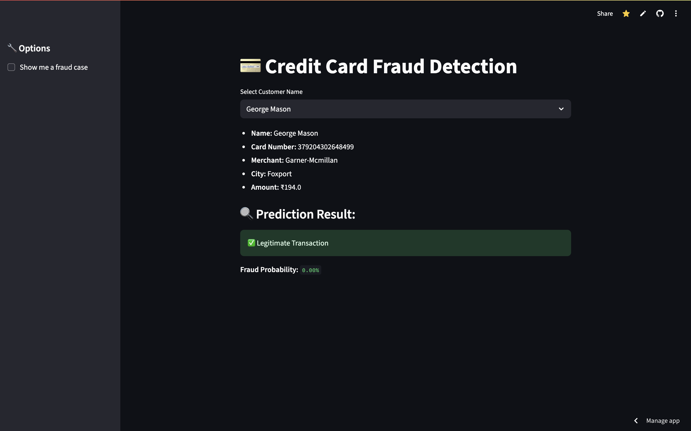
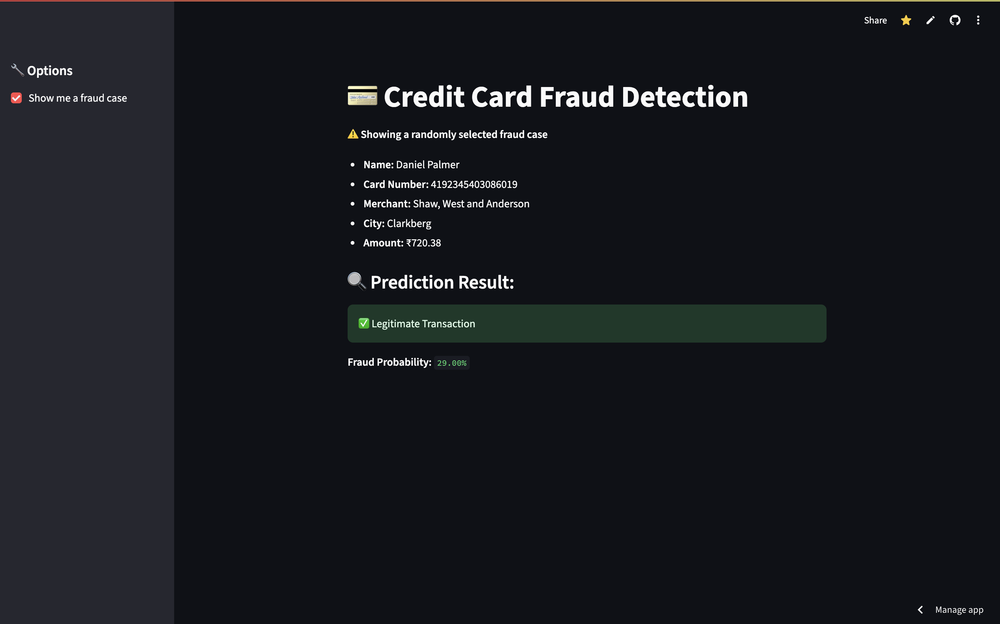

# 🛡️ SentinelShield AI — Fraud Risk Intelligence & Analyst Workspace

[](https://www.python.org/)
[](https://streamlit.io/)
[](https://scikit-learn.org/)
[](https://xgboost.readthedocs.io/)
[](LICENSE)

> **SentinelShield AI** is an enterprise-grade fraud risk intelligence platform and analyst workspace. Moving beyond basic machine learning demos, SentinelShield provides real-time portfolio surveillance, 3-tier risk classification, dynamic decision thresholding, and an interactive transaction investigation workbench for fraud operations teams.

---

## 📸 Platform Interface & Screenshots

### 1. 📊 Executive Fraud Analytics Dashboard


### 2. 🔍 Fraud Analyst Investigation View & Anomaly Explainability


---

## ⚡ Key Product Capabilities

### 1. 📊 Executive Fraud Analytics Dashboard
Surveillance and portfolio monitoring with 5 top-level KPI metrics and 4 visual distribution charts:
- **Core KPIs**:
  - 📈 **Total Transactions** — Cohort volume under active monitoring.
  - 🚨 **Fraud Cases** — Absolute count of confirmed/flagged fraudulent events.
  - 📉 **Fraud Rate** — Percentage prevalence of fraudulent transactions.
  - 💰 **Amount at Risk** — Total cumulative monetary value exposed to fraud.
  - 🎯 **Detection Rate** — Model recall and positive capture efficacy.
- **Analytics Charts**:
  - 💳 **Fraud by Transaction Amount** — Segmentation across monetary brackets (`$0–20`, `$20–50`, `$50–100`, `$100–250`, `$250–500`, `$500–1K`, `$1K+`).
  - ⏳ **Fraud Over Time** — Temporal trend of fraud volume across monitoring hours.
  - ⚖️ **Fraud vs Legitimate Transactions** — Proportional composition of transaction traffic.
  - 📈 **Risk-Score Distribution** — Histogram of model probabilities across the 0% to 100% risk spectrum.

### 2. 🎯 3-Tier Transaction Risk Levels
Rather than binary classification, SentinelShield categorizes transactions into actionable risk bands:
- `0% – 30%` ➔ **🟢 LOW RISK** (`APPROVE`)
- `30% – 70%` ➔ **🟡 MEDIUM RISK** (`MANUAL REVIEW`)
- `70% – 100%` ➔ **🔴 HIGH RISK** (`BLOCK & DECLINE`)

> **Prominent Display Format**: `Risk Score: 82% — HIGH RISK`

### 3. 🔍 Fraud Analyst Investigation View
A dedicated workspace for operations teams to triage individual transactions:
- **Transaction Identification**: Look up transactions by **Transaction ID** (`TXN-10042`), cardholder, or risk filter.
- **Investigation Fields**: Displays **Amount**, **Time Elapsed**, **Risk Score**, **Prediction**, and **Risk Level**.
- **Action Recommendations**: Direct decision recommendations including **`MANUAL REVIEW`** (for step-up auth/2FA challenge) and **`BLOCK & DECLINE`**.
- **PCA Anomaly Diagnostics**: Highlights extreme deviations in latent components ($V_{14}, V_{17}, V_{12}, V_{10}$).
- **Analyst Audit Trail**: In-session decision logging for analyst case tracking.

---

## 📁 Repository Structure

```
credit-card-fraud-detection/
├── README.md                           # Documentation, features & academic attribution
├── LICENSE                             # MIT License
├── requirements.txt                    # Project dependencies
├── .gitignore                          # Clean gitignore for large data & ML caches
├── app.py                              # Streamlit interactive application entry point
├── config.py                           # Root configuration forwarder
│
├── assets/                             # Visual assets & screenshots
│   ├── sentinel_dashboard_overview.png
│   ├── sentinel_fraud_analysis.png
│   ├── screenshot1.png
│   └── screenshot2.png
│
├── data/
│   ├── README.md                       # Dataset documentation & Kaggle source link
│   └── fraud_data_simulated.csv        # Simulated cohort with synthetic metadata
│
├── models/
│   ├── fraud_model.pkl                 # Serialized Random Forest classifier
│   └── scaler.pkl                      # Fitted StandardScaler artifact
│
├── notebooks/
│   ├── 01_exploratory_data_analysis.ipynb # EDA & Class Imbalance analysis
│   └── 02_model_benchmarking.ipynb        # Supervised baseline comparison
│
├── scripts/
│   ├── simulate_transactions.py        # Synthetic metadata enrichment CLI
│   └── add_fake_fields.py              # Backward compatibility wrapper
│
├── src/
│   ├── __init__.py                     # Package init
│   ├── config.py                       # Global constants, paths, and feature definitions
│   ├── data_preprocessing.py           # Ingestion, canonical feature ordering & scaling
│   ├── model_training.py               # Training pipelines (RF, XGBoost, LogReg)
│   ├── inference.py                    # Inference engine, risk scoring & anomaly detection
│   ├── evaluation.py                   # Classification metrics & confusion matrix
│   └── utils.py                        # Synthetic identity generators & UI formatters
│
└── tests/
    ├── __init__.py
    └── test_inference.py               # Unit tests for scoring, scaling & threshold logic
```

---

## 🚀 Quickstart Guide

### 1. Clone & Install Dependencies
```bash
git clone https://github.com/your-username/credit-card-fraud-detection.git
cd credit-card-fraud-detection
pip install -r requirements.txt
```

### 2. Launch Streamlit Application
```bash
streamlit run app.py
```

### 3. Run Test Suite
```bash
pytest tests/ -v
```

---

## 📊 Baseline Model Benchmarks

| Model Architecture | Precision | Recall | F1-Score | ROC-AUC | PR-AUC (Avg Precision) |
| :--- | :---: | :---: | :---: | :---: | :---: |
| **Random Forest (Primary Ensemble)** | **0.938** | **0.827** | **0.879** | **0.958** | **0.865** |
| **XGBoost Classifier** | 0.912 | 0.816 | 0.861 | 0.974 | 0.852 |
| **Logistic Regression (Balanced)** | 0.058 | 0.918 | 0.109 | 0.972 | 0.729 |

---

## 📚 Attribution & Academic References

### 🔬 Dataset Origin
- **Source**: [Credit Card Fraud Detection Dataset (Kaggle)](https://www.kaggle.com/datasets/mlg-ulb/creditcardfraud) released by **Worldline** and the **Université Libre de Bruxelles (ULB) Machine Learning Group**.
- **Citation**:
  > Andrea Dal Pozzolo, Olivier Caelen, Reid A. Johnson, and Gianluca Bontempi. *Calibrating Probability with Undersampling for Unbalanced Classification*. In IEEE Symposium on Computational Intelligence and Data Mining (CIDM), 2015.

### 💡 Algorithmic Baseline Disclaimer & Project Scope
- The predictive algorithms (Random Forest, Logistic Regression, XGBoost) and PCA dimensional features are standard supervised learning and dimensionality reduction implementations from open-source libraries (`scikit-learn`, `xgboost`). They are not claimed to be proprietary algorithms.
- **Project Scope & Contribution**: SentinelShield AI contributes the production-grade modular architecture, 3-tier risk scoring engine, dynamic sensitivity threshold calibration, analyst investigation workspace, and executive surveillance dashboard.

---

## 📄 License

This project is licensed under the **MIT License** — see [LICENSE](LICENSE) for details.
=======
# FraudShield
>>>>>>> f07d3267688a32795e5b1476f9fb7931279063b3
